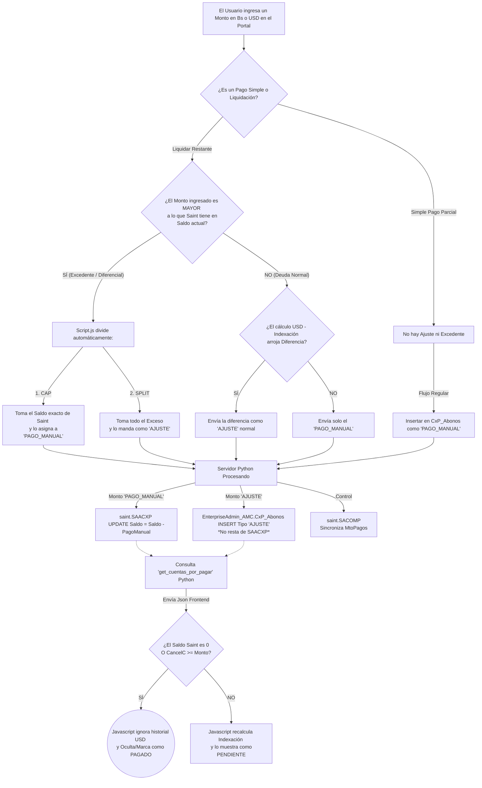

# Arquitectura de Abonos y Ajustes

Este diagrama describe cómo el sistema maneja los pagos, excedentes y la indexación entre el portal y el sistema Saint ERP.

```mermaid
graph TD
    A[El Usuario ingresa un Monto en Bs o USD en el Portal] --> B{¿Es un Pago Simple o Liquidación?}
    
    B -- Simple Pago Parcial --> C[No hay Ajuste ni Excedente]
    B -- Liquidar Restante --> D{¿El Monto ingresado es MAYOR <br> a lo que Saint tiene en Saldo actual?}
    
    C --> |Flujo Regular| Z[Insertar en CxP_Abonos como 'PAGO_MANUAL']
    
    D -- SÍ (Excedente / Diferencial) --> E[Script.js divide automáticamente:]
    D -- NO (Deuda Normal) --> F{¿El cálculo USD - Indexación <br>arroja Diferencia?}
    
    E --> |1. CAP| E1[Toma el Saldo exacto de Saint <br> y lo asigna a 'PAGO_MANUAL']
    E --> |2. SPLIT| E2[Toma todo el Exceso <br> y lo manda como 'AJUSTE']
    
    F -- SÍ --> F1[Envía la diferencia como 'AJUSTE' normal]
    F -- NO --> F2[Envía solo el 'PAGO_MANUAL']
    
    %% Flujo de Backend
    E1 --> Y[Servidor Python Procesando]
    E2 --> Y
    F1 --> Y
    F2 --> Y
    Z --> Y
    
    Y --> |Monto 'PAGO_MANUAL'| DB1[saint.SAACXP <br> UPDATE Saldo = Saldo - PagoManual]
    Y --> |Monto 'AJUSTE'| DB2[EnterpriseAdmin_AMC.CxP_Abonos <br> INSERT Tipo 'AJUSTE' <br>*No resta de SAACXP*]
    Y --> |Control| DB3[saint.SACOMP <br> Sincroniza MtoPagos]

    %% Flujo de Vista (Frontend Loopback)
    DB1 -.-> O[Consulta 'get_cuentas_por_pagar' Python]
    DB2 -.-> O
    
    O --> |Envía Json Frontend| V{¿El Saldo Saint es 0 <br> O CancelC >= Monto?}
    V -- SÍ --> V1((Javascript ignora historial USD <br>y Oculta/Marca como PAGADO))
    V -- NO --> V2[Javascript recalcula Indexación <br> y lo muestra como PENDIENTE]
```
